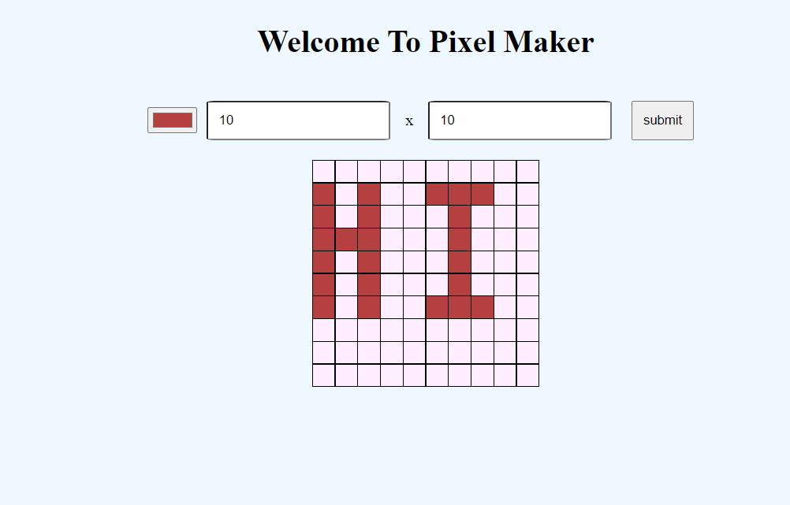

## About The Project
This is a fun application thatlets the user create a grid of squares representing their design, and apply colors to those squares to create a digital masterpiece!

### Built With
* Vanilla Javascript
* CSS
* HTML5

## Usage
A user is able to:

- Dynamically set the size of the table as an _N_ x _M_ grid.
- Choose a color.
- Click a cell in the grid to fill that cell with the chosen color.
